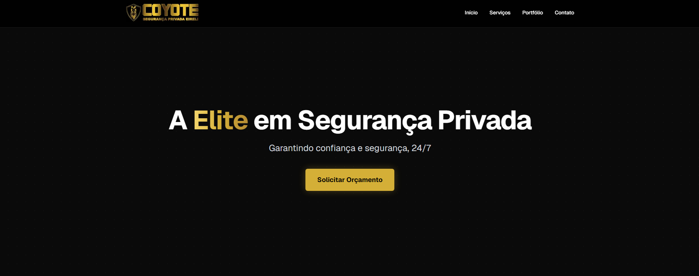
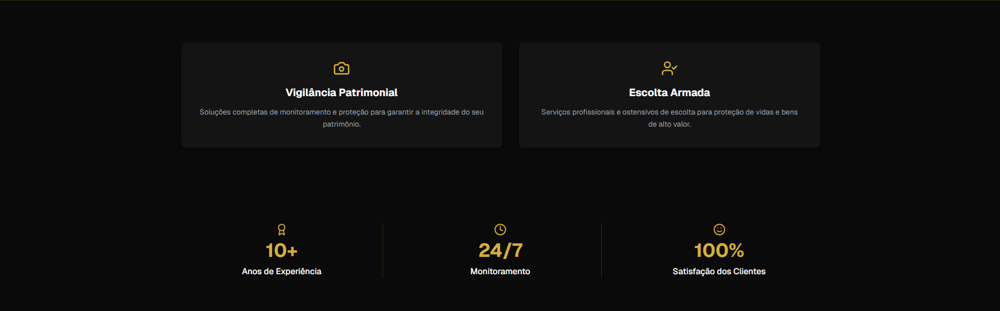
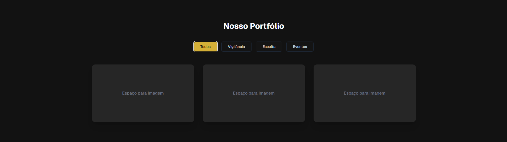
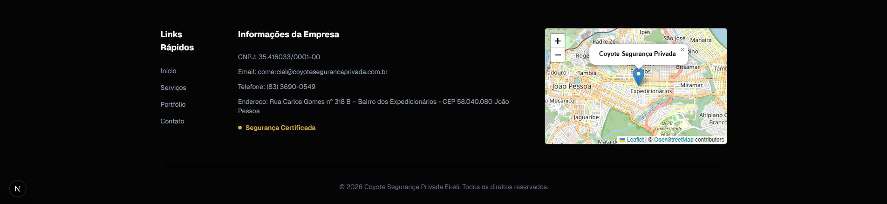

# Coyote Segurança Privada

Uma landing page moderna, responsiva e de alta performance desenvolvida para a **Coyote Segurança Privada**, uma empresa de elite focada na proteção patrimonial, escolta VIP, vigilância e eventos de grande porte.

## 📸 Imagens do Projeto

> **Nota:** Adicione as imagens reais do projeto substituindo os caminhos abaixo.


*Tela Inicial com o menu de navegação e seção Hero*


*Seção detalhada sobre os serviços prestados e portfólio da empresa*


*Área de estatísticas destacando a confiança e os anos de mercado*


*Área de contato contendo as informações da empresa e mapa interativo (Leaflet)*

---

## 🚀 Tecnologias Utilizadas

Este projeto foi construído utilizando as seguintes tecnologias:

- **[Next.js](https://nextjs.org/)** (v14/15) - Framework React para o Frontend com SSR/SSG.
- **[React](https://reactjs.org/)** - Biblioteca JavaScript para construção de interfaces.
- **[Tailwind CSS](https://tailwindcss.com/)** - Estruturação visual e estilização do escopo (arquitetura global e customizada, com variáveis CSS integradas).
- **[Leaflet](https://leafletjs.com/)** - Renderização do Mapa interativo no rodapé para localização.
- **[Lucide React](https://lucide.dev/)** - Biblioteca de ícones no padrão visual limpo.
- **[TypeScript](https://www.typescriptlang.org/)** - Tipagem estática para JavaScript.

## 🛠️ Funcionalidades

- **Design Responsivo**: Adaptado para Desktop, Tablets e Dispositivos Móveis (First-Mobile concept).
- **Animações e Efeitos CSS**: Efeitos de *Hover*, Blur (Glassmorphism), sombreamento e elementos translúcidos de alto padrão (`bg-clip-text`, `bg-gradient-to-r`).
- **Navegação Âncora Suave**: Roteamento dinâmico sem reload entre as seções (Início, Serviços, Portfólio, Contato).
- **Mapa Dinâmico**: Visualização amigável de endereço utilizando OpenStreetMap & Leaflet carregados sob demanda via *Dynamic Imports* no Next.js.
- **Estruturação de Cores Globais**: Fácil modificação do tema via custom properties e classes globais do CSS em `globals.css` (`--color-gold`, `--color-background-dark`, etc).

## 💻 Como Rodar o Projeto

Siga as instruções abaixo para executar o projeto em seu ambiente local.

### 1. Clone o repositório ou acesse a pasta do projeto

```bash
cd coyote
```

### 2. Instale as dependências

Certifique-se de ter o Node.js e o NPM/Yarn instalados.

```bash
npm install
# ou
yarn install
```

### 3. Inicie o servidor de desenvolvimento

```bash
npm run dev
# ou
yarn dev
```

### 4. Visualize no Navegador

Abra [http://localhost:3000](http://localhost:3000) no seu navegador e você verá o projeto em execução!

---

## 📂 Estrutura de Diretórios Básica

- `/app`: Configurações de rotas (App Router do Next.js), layout raiz (`layout.tsx`), página inicial (`page.tsx`) e configurações visuais globais (`globals.css`).
- `/components`: Todos os componentes focados e reaproveitáveis da aplicação original (`Header.tsx`, `Hero.tsx`, `Stats.tsx`, `Portfolio.tsx`, `Footer.tsx`).
- `/public`: Assets públicos do projeto (Logo, favicons e outras imagens necessárias).

---

Feito com estratégia visual de excelência focado na Elite em Segurança Privada. 🛡️
